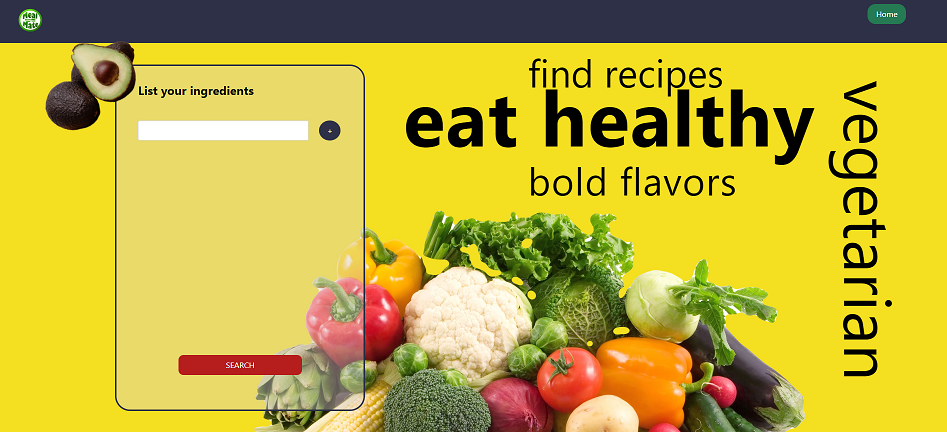
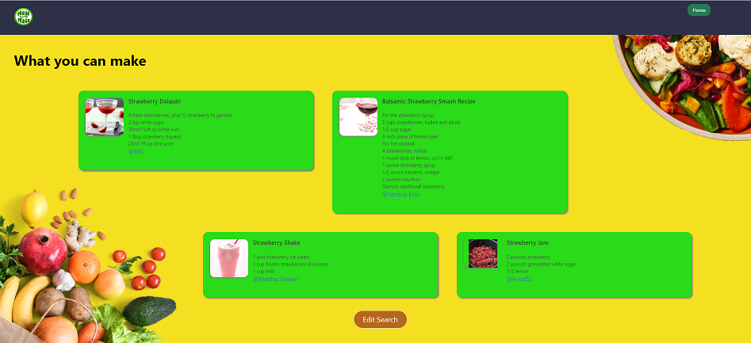

# Meal Mate

## Description 
This is our React app that can help you decide on what to cook based on what ingredients you have. More options for searching will be added in the future.

## Usage

### Application link
The application can accessed through the URL: [https://meal-mate.netlify.app/](https://meal-mate.netlify.app/)

### Home screen 

Here you are presented with the name of the app.

### Ingredient listing

Here you can enter your available ingredients.

### Recipes to choose

And here are your options based on what you have.

## Technologies Used

- React: Used to build the frontend of the app
- Bulma framework: Used for styling
- Edamam API: Used to fetch recipe data
